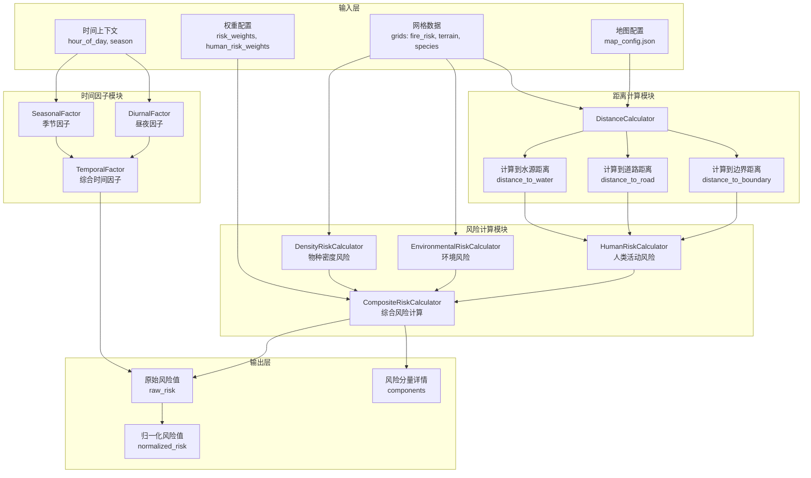
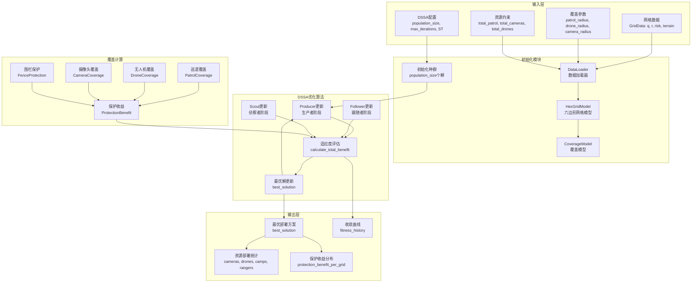
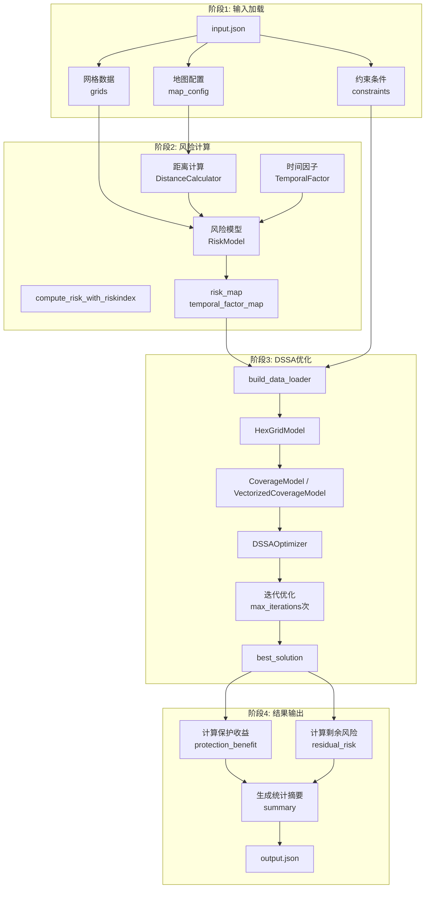
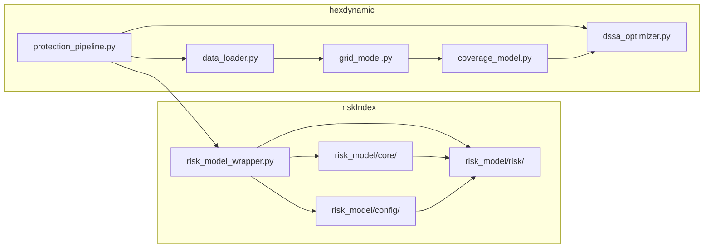

# 核心流程图文档

本文档描述了 riskIndex 风险计算模块和 DSSA 优化算法的核心流程。

## 1. riskIndex 风险计算流程

riskIndex 模块负责计算保护区内每个网格的综合风险指数，包括人类活动风险、环境风险和物种密度风险。

### 1.1 核心流程图



### 1.2 风险计算公式

综合风险计算公式：

```
R'_{i,t} = (ω₁·H_{i,t} + ω₂·E_i + ω₃·Σ_s w_s·D_{s,i,t}) × T_t × S_t

R_i = (R'_{i,t} - R_min) / (R_max - R_min)
```

| 符号 | 说明 |
|------|------|
| H_{i,t} | 人类活动风险（边界/道路/水源距离） |
| E_i | 环境风险（火灾风险 + 地形复杂度） |
| D_{s,i,t} | 物种密度风险 |
| T_t | 昼夜因子 |
| S_t | 季节因子 |

### 1.3 主要组件

| 组件 | 文件 | 功能 |
|------|------|------|
| DistanceCalculator | risk_model_wrapper.py | 计算网格到各特征的距离 |
| HumanRiskCalculator | risk_model/risk/human.py | 计算人类活动风险 |
| EnvironmentalRiskCalculator | risk_model/risk/environmental.py | 计算环境风险 |
| DensityRiskCalculator | risk_model/risk/density.py | 计算物种密度风险 |
| CompositeRiskCalculator | risk_model/risk/composite.py | 综合风险计算 |
| RiskModel | risk_model/risk/model.py | 风险模型入口 |

---

## 2. DSSA 优化算法流程

DSSA (Drone Swarm Scheduling Algorithm) 是一种基于麻雀搜索算法的资源部署优化算法，用于优化保护区内的巡逻资源分配。

### 2.1 核心流程图



### 2.2 DSSA 算法参数

| 参数 | 默认值 | 说明 |
|------|--------|------|
| population_size | 50 | 种群大小 |
| max_iterations | 100 | 最大迭代次数 |
| producer_ratio | 0.2 | 生产者比例 |
| scout_ratio | 0.2 | 侦察者比例 |
| ST | 0.8 | 安全阈值 |
| R2 | 0.5 | 警戒阈值（已弃用，现动态生成） |

### 2.3 三种角色更新策略

#### Producer（生产者）
- **正常更新 (R2 < ST)**: 向最优解方向移动
- **警戒更新 (R2 >= ST)**: 大范围随机探索

#### Follower（跟随者）
- **正常更新**: 跟随生产者或向最优解移动
- **警戒更新**: 大范围随机探索

#### Scout（侦察者）
- 当适应度低于阈值时，重新初始化

### 2.4 主要组件

| 组件 | 文件 | 功能 |
|------|------|------|
| DSSAOptimizer | dssa_optimizer.py | DSSA优化器主类 |
| DSSAConfig | dssa_optimizer.py | 算法配置 |
| CoverageModel | coverage_model.py | 覆盖模型 |
| VectorizedCoverageModel | coverage_model_vectorized.py | 向量化覆盖模型（大规模地图） |
| HexGridModel | grid_model.py | 六边形网格模型 |
| DataLoader | data_loader.py | 数据加载器 |

---

## 3. Protection Pipeline 完整流程

Protection Pipeline 整合了风险计算和DSSA优化，提供端到端的保护资源优化方案。

### 3.1 完整流程图



### 3.2 使用方式

```bash
# 基本用法
python protection_pipeline.py input.json output.json

# 使用向量化模型（大规模地图）
python protection_pipeline.py input.json output.json --vectorized

# 允许部分部署
python protection_pipeline.py input.json output.json --allow-partial-deployment

# 冻结特定资源
python protection_pipeline.py input.json output.json --freeze-resources patrol,camera
```

### 3.3 输出结果结构

```json
{
  "summary": {
    "total_grids": 120,
    "total_risk": 45.6,
    "best_fitness": 123.45,
    "total_protection_benefit": 89.2,
    "risk_min": 0.1,
    "risk_max": 0.9,
    "residual_risk_mean": 0.35,
    "resources_deployed": {
      "total_cameras": 10,
      "total_drones": 3,
      "total_camps": 5,
      "total_rangers": 20,
      "fence_segments": 15
    }
  },
  "grids": [...],
  "fence_edges": [...]
}
```

---

## 4. 模块依赖关系



---

## 5. 参考资料

- [riskIndex README](../riskIndex/README.md)
- [DSSA 设计文档](./DSSA_DESIGN_DOCUMENT.md)
- [快速开始指南](../QUICK_START_GUIDE.md)
